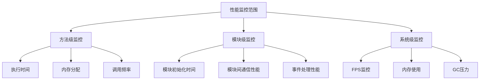
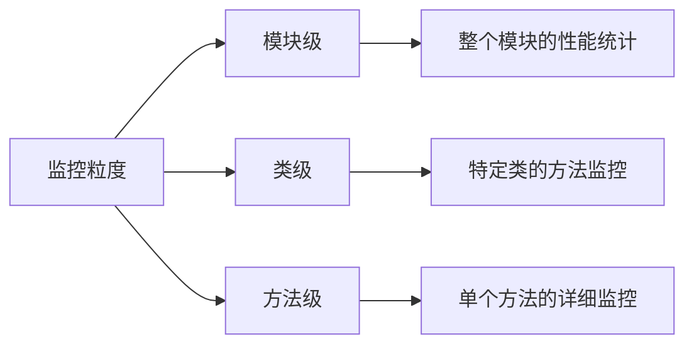
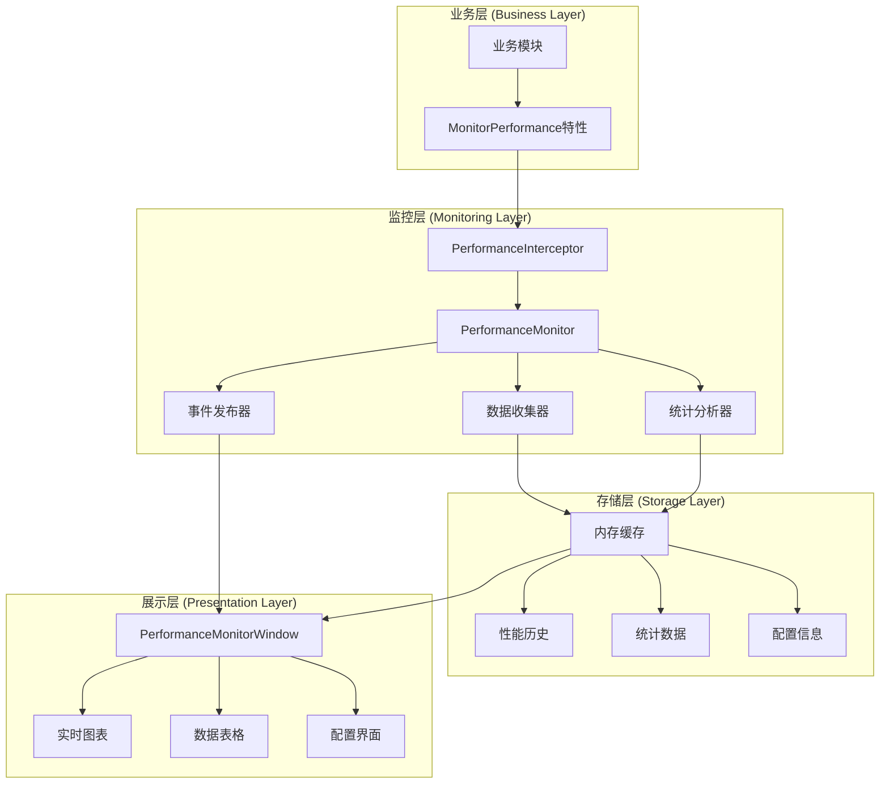
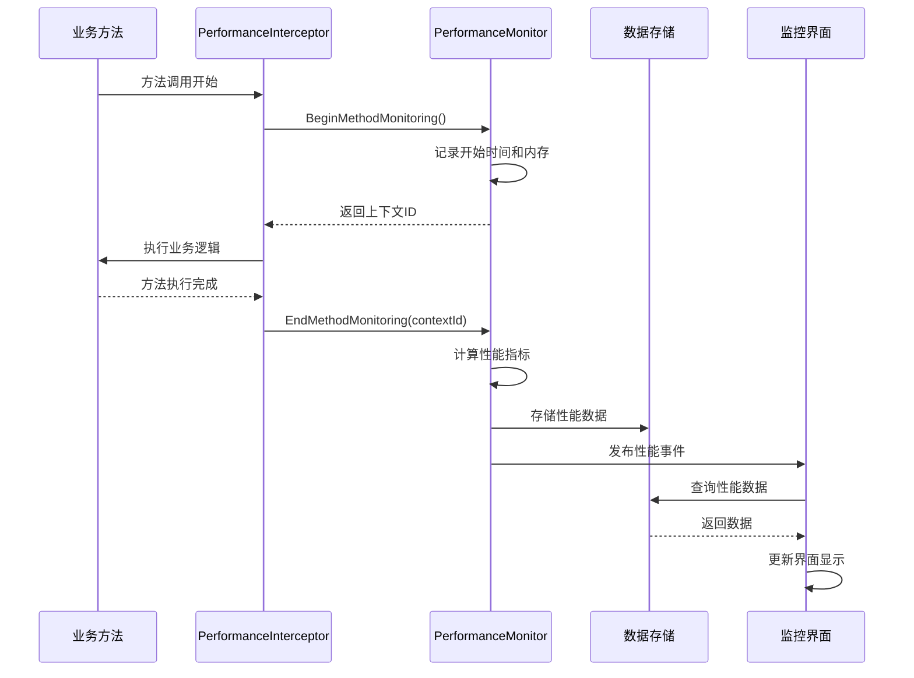

# 🚀 Cnoom Unity Framework 轻量级性能监控方案

## 📋 目录
- [1. 方案概述](#1-方案概述)
- [2. 核心特性](#2-核心特性)
- [3. 架构设计](#3-架构设计)
- [4. 实现细节](#4-实现细节)
- [5. 使用指南](#5-使用指南)
- [6. 性能优化](#6-性能优化)
- [7. 扩展指南](#7-扩展指南)

---

## 1. 方案概述

### 1.1 设计目标

本性能监控方案旨在为Cnoom Unity Framework提供**轻量级、无侵入性、可配置**的性能监控能力，满足以下核心需求：

- ✅ **方法级性能指标采集** - 支持执行耗时、资源占用等关键指标
- ✅ **可配置监控粒度** - 支持按模块/类/方法维度进行监控
- ✅ **实时Unity界面监控仪表盘** - 提供直观的可视化监控界面
- ✅ **业务代码无侵入性** - 通过特性和拦截器实现透明监控

### 1.2 技术特点

| 特性 | 描述 | 优势 |
|------|------|------|
| **轻量级设计** | 最小化性能开销，采用高效的数据结构和算法 | 对业务性能影响极小 |
| **无侵入监控** | 通过特性标记和拦截器实现，无需修改业务代码 | 易于集成和维护 |
| **实时可视化** | Unity编辑器内置监控面板，实时显示性能数据 | 直观的开发体验 |
| **灵活配置** | 支持运行时动态配置监控参数 | 适应不同场景需求 |
| **数据持久化** | 支持性能数据导出和历史记录查询 | 便于性能分析和优化 |

### 1.3 监控范围



---

## 2. 核心特性

### 2.1 方法级性能指标采集

#### 支持的性能指标

| 指标类型 | 描述 | 单位 | 用途 |
|----------|------|------|------|
| **执行时间** | 方法从开始到结束的耗时 | 毫秒(ms) | 识别性能瓶颈 |
| **内存分配** | 方法执行前后的内存变化 | 字节(bytes) | 检测内存泄漏 |
| **调用频率** | 单位时间内的方法调用次数 | 次/秒 | 分析热点方法 |
| **线程信息** | 方法执行所在的线程ID | - | 并发分析 |
| **调用堆栈** | 方法调用的上下文信息 | - | 问题定位 |

#### 使用示例

```csharp
public class PlayerController : BaseModule
{
    [MonitorPerformance("玩家更新", RecordToGlobalStats = true)]
    public void UpdatePlayer()
    {
        // 业务逻辑
        ProcessMovement();
        ProcessAnimation();
        ProcessInput();
    }
    
    [MonitorPerformance("移动处理")]
    private void ProcessMovement()
    {
        // 移动逻辑
    }
}
```

### 2.2 可配置监控粒度

#### 三级监控粒度



#### 配置方式

```csharp
// 1. 全局配置
ConfigManager.SetValue("Performance.EnableMonitoring", true);
ConfigManager.SetValue("Performance.MonitoringLevel", "Method"); // Module/Class/Method

// 2. 模块级配置
[AutoRegisterModule]
[MonitorModule(Level = MonitoringLevel.Detailed)]
public class CombatModule : BaseModule { }

// 3. 方法级配置
[MonitorPerformance(
    OperationName = "战斗计算",
    RecordToGlobalStats = true,
    EnableMemoryTracking = true,
    SamplingRate = 1.0f // 100%采样
)]
public void CalculateDamage() { }
```

### 2.3 实时Unity界面监控仪表盘

#### 仪表盘功能模块

| 模块 | 功能 | 特点 |
|------|------|------|
| **概览面板** | 显示整体性能状况和关键指标 | 一目了然的系统状态 |
| **实时监控** | 实时图表显示FPS、内存、执行时间等 | 动态性能曲线 |
| **历史数据** | 查看历史性能记录和趋势分析 | 支持过滤和搜索 |
| **统计分析** | 模块和方法的性能统计排行 | 识别性能热点 |
| **设置面板** | 配置监控参数和显示选项 | 灵活的个性化设置 |

#### 界面预览

```
┌─────────────────────────────────────────────────────────────┐
│ 性能监控 - Cnoom Framework                    [●] 监控中    │
├─────────────────────────────────────────────────────────────┤
│ [概览] [实时监控] [历史数据] [统计分析] [设置]              │
├─────────────────────────────────────────────────────────────┤
│ 实时指标:  FPS: 60.0  帧时间: 16.7ms  内存: 245MB  活跃: 3 │
├─────────────────────────────────────────────────────────────┤
│                                                             │
│  FPS 图表                                                   │
│  ┌─────────────────────────────────────────────────────┐   │
│  │     ╭─╮                                             │   │
│  │   ╭─╯ ╰─╮                                           │   │
│  │ ╭─╯     ╰─╮                                         │   │
│  │╱         ╰─────────────────────────────────────     │   │
│  └─────────────────────────────────────────────────────┘   │
│                                                             │
│  执行时间 Top 5:                                           │
│  1. PlayerModule.UpdatePlayer     2.34ms  (1,234 次)      │
│  2. UIModule.RefreshUI           1.89ms  (567 次)         │
│  3. AudioModule.ProcessAudio     1.23ms  (890 次)         │
│                                                             │
└─────────────────────────────────────────────────────────────┘
```

---

## 3. 架构设计

### 3.1 整体架构



### 3.2 核心组件设计

#### PerformanceMonitor - 核心监控器

```csharp
public class PerformanceMonitor : BaseModule
{
    // 核心功能
    - BeginMethodMonitoring()    // 开始监控
    - EndMethodMonitoring()      // 结束监控
    - RecordPerformanceMetrics() // 记录指标
    - GeneratePerformanceReport() // 生成报告
    
    // 数据管理
    - GetPerformanceHistory()    // 获取历史数据
    - GetModuleStatistics()      // 获取模块统计
    - GetMethodStatistics()      // 获取方法统计
    - ClearHistory()             // 清空历史
    
    // 配置管理
    - SetEnabled()               // 启用/禁用监控
    - SetSamplingInterval()      // 设置采样间隔
    - LoadConfiguration()        // 加载配置
}
```

#### PerformanceInterceptor - 性能拦截器

```csharp
public static class PerformanceInterceptor
{
    // 拦截功能
    - BeforeMethodExecution()    // 方法执行前拦截
    - AfterMethodExecution()     // 方法执行后拦截
    - MonitorOperation()         // 手动监控操作
    - CreateScope()              // 创建监控作用域
    
    // 辅助功能
    - GetModuleName()            // 获取模块名称
    - Initialize()               // 初始化拦截器
}
```

### 3.3 数据流设计



---

## 4. 实现细节

### 4.1 无侵入性监控实现

#### 特性驱动的监控

```csharp
[AttributeUsage(AttributeTargets.Method)]
public class MonitorPerformanceAttribute : Attribute
{
    public string OperationName { get; set; }
    public bool RecordToGlobalStats { get; set; } = true;
    public bool EnableMemoryTracking { get; set; } = true;
    public float SamplingRate { get; set; } = 1.0f;
    public MonitoringLevel Level { get; set; } = MonitoringLevel.Method;
}
```

#### 自动拦截机制

通过反射和代理模式实现自动拦截：

```csharp
// 在模块初始化时自动扫描和注册监控方法
private void RegisterPerformanceMonitoring(IModule module)
{
    var type = module.GetType();
    var methods = type.GetMethods(BindingFlags.Instance | BindingFlags.Public | BindingFlags.NonPublic);
    
    foreach (var method in methods)
    {
        var attr = method.GetCustomAttribute<MonitorPerformanceAttribute>();
        if (attr != null)
        {
            // 创建方法代理，在调用前后插入监控逻辑
            CreateMethodProxy(module, method, attr);
        }
    }
}
```

### 4.2 高性能数据收集

#### 内存优化的数据结构

```csharp
// 使用对象池减少GC压力
private readonly ObjectPool<PerformanceMetrics> _metricsPool;

// 使用环形缓冲区存储历史数据
private readonly RingBuffer<PerformanceMetrics> _historyBuffer;

// 使用并发集合支持多线程访问
private readonly ConcurrentDictionary<string, PerformanceStatistics> _statistics;
```

#### 高精度时间测量

```csharp
// 使用Stopwatch获得高精度时间测量
private static readonly long _stopwatchFrequency = Stopwatch.Frequency;

public static TimeSpan GetElapsedTime(long startTimestamp, long endTimestamp)
{
    var elapsedTicks = (endTimestamp - startTimestamp) * TimeSpan.TicksPerSecond / _stopwatchFrequency;
    return new TimeSpan(elapsedTicks);
}
```

### 4.3 智能采样策略

#### 自适应采样率

```csharp
public class AdaptiveSampler
{
    private float _currentSamplingRate = 1.0f;
    private int _recentCallCount = 0;
    private DateTime _lastAdjustment = DateTime.UtcNow;
    
    public bool ShouldSample(string methodName)
    {
        _recentCallCount++;
        
        // 根据调用频率动态调整采样率
        if ((DateTime.UtcNow - _lastAdjustment).TotalSeconds >= 1.0)
        {
            AdjustSamplingRate();
            _lastAdjustment = DateTime.UtcNow;
            _recentCallCount = 0;
        }
        
        return Random.value <= _currentSamplingRate;
    }
    
    private void AdjustSamplingRate()
    {
        // 高频调用降低采样率，低频调用提高采样率
        if (_recentCallCount > 1000)
            _currentSamplingRate = Mathf.Max(0.1f, _currentSamplingRate * 0.8f);
        else if (_recentCallCount < 100)
            _currentSamplingRate = Mathf.Min(1.0f, _currentSamplingRate * 1.2f);
    }
}
```

---

## 5. 使用指南

### 5.1 快速开始

#### 步骤1: 启用性能监控

```csharp
// 在框架初始化后启用性能监控
var frameworkManager = FrameworkManager.Instance;
frameworkManager.Initialize();

var performanceMonitor = frameworkManager.GetModule<PerformanceMonitor>();
performanceMonitor.SetEnabled(true);
```

#### 步骤2: 标记需要监控的方法

```csharp
public class GameLogicModule : BaseModule
{
    [MonitorPerformance("游戏逻辑更新")]
    protected override void OnStart()
    {
        // 模块启动逻辑
    }
    
    [MonitorPerformance("AI计算", RecordToGlobalStats = true)]
    public void UpdateAI()
    {
        // AI更新逻辑
    }
}
```

#### 步骤3: 打开监控界面

在Unity编辑器中：`Cnoom Framework -> Performance Monitor`

### 5.2 高级用法

#### 手动监控代码块

```csharp
// 使用监控作用域
using (PerformanceInterceptor.CreateScope("复杂计算", "MathModule"))
{
    // 需要监控的代码
    ComplexCalculation();
}

// 使用扩展方法
var action = SomeHeavyOperation.WithPerformanceMonitoring("重型操作", "WorkerModule");
action();
```

#### 自定义性能事件处理

```csharp
public class CustomPerformanceHandler : BaseModule
{
    [BroadcastHandler]
    private void OnPerformanceWarning(PerformanceWarningEvent evt)
    {
        if (evt.ExecutionTime.TotalMilliseconds > 50)
        {
            Debug.LogWarning($"性能警告: {evt.OperationName} 执行时间过长 ({evt.ExecutionTime.TotalMilliseconds:F2}ms)");
        }
    }
    
    [BroadcastHandler]
    private void OnPerformanceReport(PerformanceReportEvent evt)
    {
        var report = evt.Report;
        Debug.Log($"性能报告: 平均执行时间 {report.AverageExecutionTime.TotalMilliseconds:F2}ms");
    }
}
```

### 5.3 配置选项

#### 通过配置文件

```json
{
  "Performance": {
    "EnableMonitoring": true,
    "SamplingInterval": 1.0,
    "MaxHistoryCount": 1000,
    "EnableMemoryTracking": true,
    "EnableModuleStats": true,
    "MonitoringLevel": "Method",
    "AutoExportInterval": 300
  }
}
```

#### 通过代码配置

```csharp
var config = frameworkManager.ConfigManager;
config.SetValue("Performance.EnableMonitoring", true);
config.SetValue("Performance.SamplingInterval", 0.5f);
config.SetValue("Performance.MaxHistoryCount", 2000);
```

---

## 6. 性能优化

### 6.1 监控开销最小化

#### 编译时优化

```csharp
#if UNITY_EDITOR || DEVELOPMENT_BUILD
    [MonitorPerformance("开发版本监控")]
    public void DevelopmentOnlyMethod() { }
#endif

// 使用条件编译减少发布版本的监控开销
[System.Diagnostics.Conditional("ENABLE_PERFORMANCE_MONITORING")]
public static void RecordMetrics(PerformanceMetrics metrics) { }
```

#### 运行时优化

```csharp
// 使用对象池避免频繁分配
private static readonly ObjectPool<PerformanceMetrics> MetricsPool = 
    new ObjectPool<PerformanceMetrics>(() => new PerformanceMetrics());

// 批量处理减少锁竞争
private readonly List<PerformanceMetrics> _batchBuffer = new List<PerformanceMetrics>();
private void ProcessMetricsBatch()
{
    lock (_batchBuffer)
    {
        foreach (var metrics in _batchBuffer)
        {
            ProcessSingleMetrics(metrics);
        }
        _batchBuffer.Clear();
    }
}
```

### 6.2 内存管理优化

#### 智能缓存策略

```csharp
public class PerformanceDataCache
{
    private readonly LRUCache<string, PerformanceStatistics> _statsCache;
    private readonly TimeBasedCache<PerformanceMetrics> _historyCache;
    
    public PerformanceDataCache(int maxSize, TimeSpan maxAge)
    {
        _statsCache = new LRUCache<string, PerformanceStatistics>(maxSize);
        _historyCache = new TimeBasedCache<PerformanceMetrics>(maxAge);
    }
    
    public void AddMetrics(PerformanceMetrics metrics)
    {
        // 自动清理过期数据
        _historyCache.Add(metrics.Timestamp, metrics);
        
        // 更新统计缓存
        var key = $"{metrics.ModuleName}.{metrics.MethodName}";
        _statsCache.GetOrAdd(key, () => new PerformanceStatistics(key))
                   .AddSample(metrics.ExecutionTime, metrics.MemoryDelta);
    }
}
```

### 6.3 异步处理优化

#### 后台数据处理

```csharp
public class AsyncPerformanceProcessor
{
    private readonly Channel<PerformanceMetrics> _metricsChannel;
    private readonly CancellationTokenSource _cancellationTokenSource;
    
    public AsyncPerformanceProcessor()
    {
        _metricsChannel = Channel.CreateUnbounded<PerformanceMetrics>();
        _ = Task.Run(ProcessMetricsAsync);
    }
    
    private async Task ProcessMetricsAsync()
    {
        await foreach (var metrics in _metricsChannel.Reader.ReadAllAsync(_cancellationTokenSource.Token))
        {
            // 在后台线程处理性能数据
            await ProcessMetricsInBackground(metrics);
        }
    }
    
    public void EnqueueMetrics(PerformanceMetrics metrics)
    {
        _metricsChannel.Writer.TryWrite(metrics);
    }
}
```

---

## 7. 扩展指南

### 7.1 自定义性能指标

#### 添加新的性能指标

```csharp
public class CustomPerformanceMetrics : PerformanceMetrics
{
    public float CPUUsage { get; set; }
    public int NetworkRequests { get; set; }
    public float BatteryLevel { get; set; }
    
    // 自定义指标收集逻辑
    public static CustomPerformanceMetrics Collect(string operationName)
    {
        return new CustomPerformanceMetrics
        {
            OperationName = operationName,
            CPUUsage = GetCPUUsage(),
            NetworkRequests = GetActiveNetworkRequests(),
            BatteryLevel = SystemInfo.batteryLevel,
            Timestamp = DateTime.UtcNow
        };
    }
}
```

#### 自定义监控特性

```csharp
[AttributeUsage(AttributeTargets.Method)]
public class MonitorNetworkPerformanceAttribute : MonitorPerformanceAttribute
{
    public bool TrackBandwidth { get; set; } = true;
    public bool TrackLatency { get; set; } = true;
    
    public override void OnMethodStart(MethodExecutionContext context)
    {
        base.OnMethodStart(context);
        
        if (TrackBandwidth)
            context.StartBandwidthMonitoring();
        if (TrackLatency)
            context.StartLatencyMonitoring();
    }
}
```

### 7.2 自定义可视化组件

#### 创建自定义图表

```csharp
public class CustomPerformanceChart : IPerformanceChart
{
    public void DrawChart(Rect rect, List<float> data, ChartStyle style)
    {
        // 自定义图表绘制逻辑
        DrawBackground(rect, style.BackgroundColor);
        DrawGridLines(rect, style.GridColor);
        DrawDataLine(rect, data, style.LineColor);
        DrawLabels(rect, data, style.LabelStyle);
    }
    
    private void DrawHeatmap(Rect rect, float[,] data)
    {
        // 热力图绘制逻辑
        for (int x = 0; x < data.GetLength(0); x++)
        {
            for (int y = 0; y < data.GetLength(1); y++)
            {
                var color = GetHeatmapColor(data[x, y]);
                var cellRect = GetCellRect(rect, x, y);
                EditorGUI.DrawRect(cellRect, color);
            }
        }
    }
}
```

### 7.3 集成外部监控系统

#### 数据导出接口

```csharp
public interface IPerformanceExporter
{
    Task ExportAsync(IEnumerable<PerformanceMetrics> metrics, ExportFormat format);
    bool SupportsFormat(ExportFormat format);
}

public class PrometheusExporter : IPerformanceExporter
{
    public async Task ExportAsync(IEnumerable<PerformanceMetrics> metrics, ExportFormat format)
    {
        var prometheusData = ConvertToPrometheusFormat(metrics);
        await SendToPrometheus(prometheusData);
    }
    
    private string ConvertToPrometheusFormat(IEnumerable<PerformanceMetrics> metrics)
    {
        var sb = new StringBuilder();
        foreach (var metric in metrics)
        {
            sb.AppendLine($"method_execution_time{{module=\"{metric.ModuleName}\",method=\"{metric.MethodName}\"}} {metric.ExecutionTime.TotalMilliseconds}");
            sb.AppendLine($"method_memory_delta{{module=\"{metric.ModuleName}\",method=\"{metric.MethodName}\"}} {metric.MemoryDelta}");
        }
        return sb.ToString();
    }
}
```

---

## 🎯 总结

本轻量级性能监控方案为Cnoom Unity Framework提供了：

✅ **完整的监控能力** - 从方法级到系统级的全面性能监控
✅ **无侵入性设计** - 通过特性和拦截器实现透明监控
✅ **实时可视化界面** - Unity编辑器内置的直观监控仪表盘
✅ **高性能实现** - 最小化监控开销，支持生产环境使用
✅ **灵活的扩展性** - 支持自定义指标、图表和导出格式
✅ **智能化特性** - 自适应采样、异步处理、智能缓存

通过这套方案，开发者可以轻松监控Unity项目的性能状况，快速识别性能瓶颈，优化代码质量，提升用户体验。