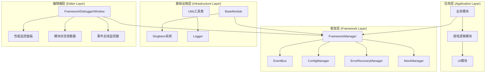
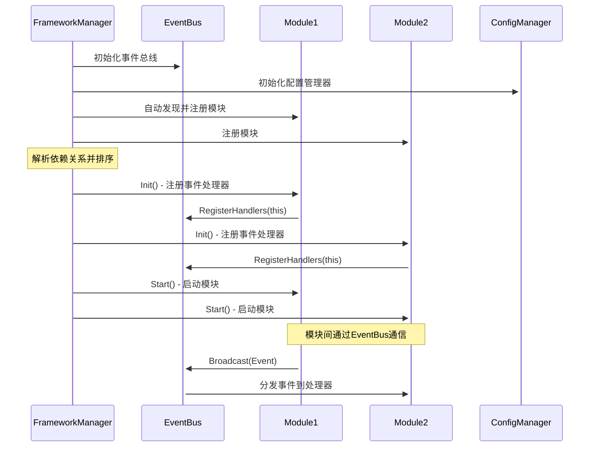
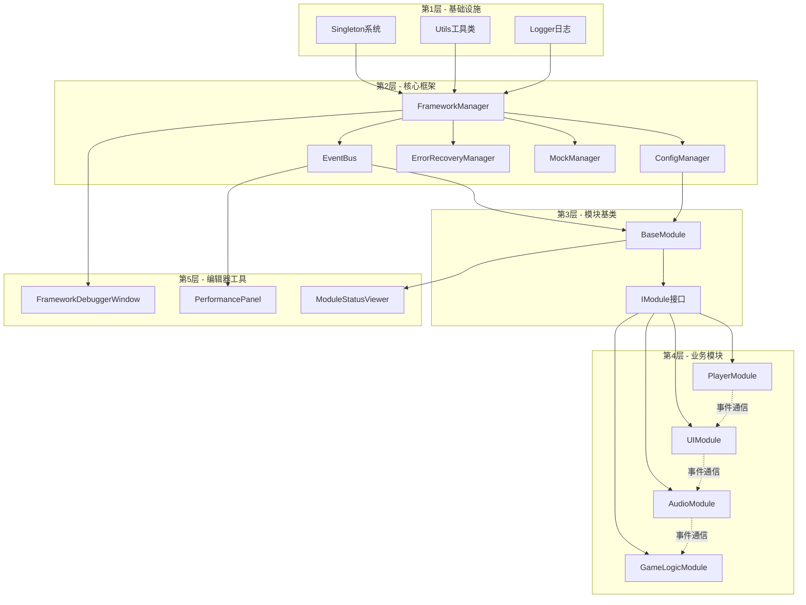
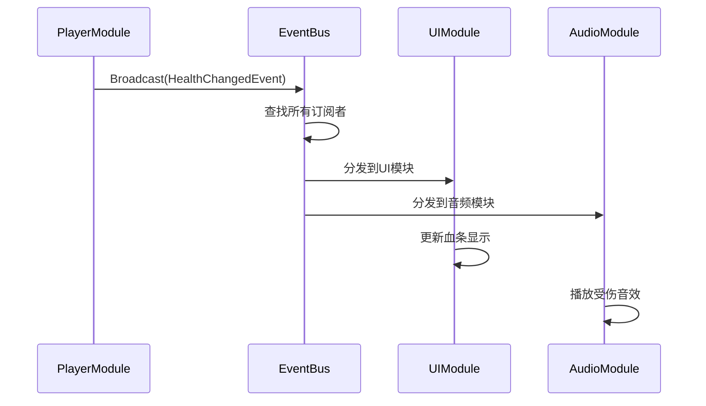
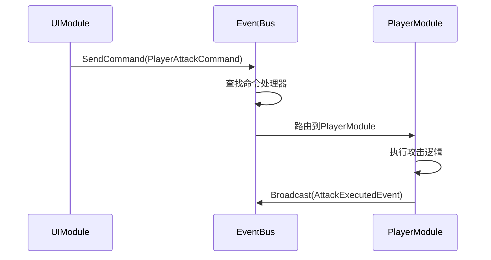
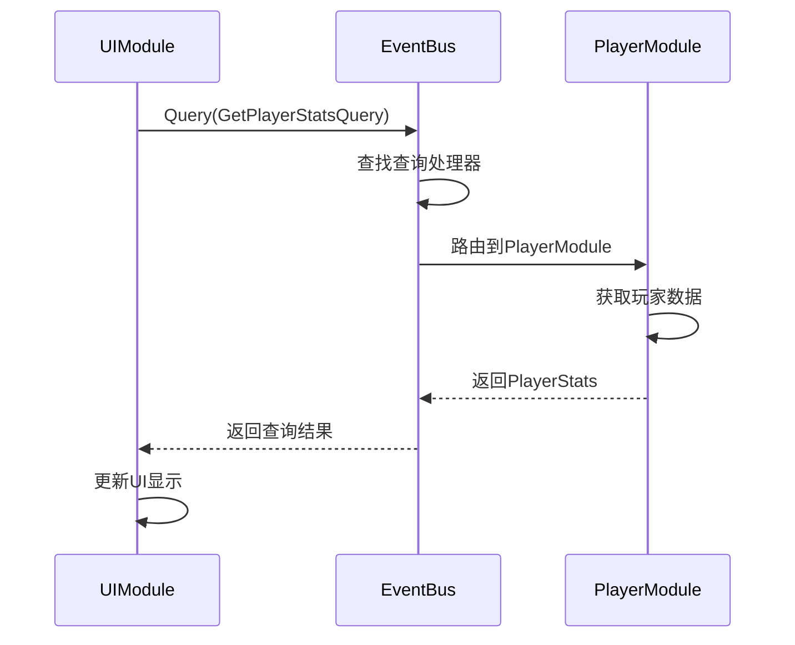
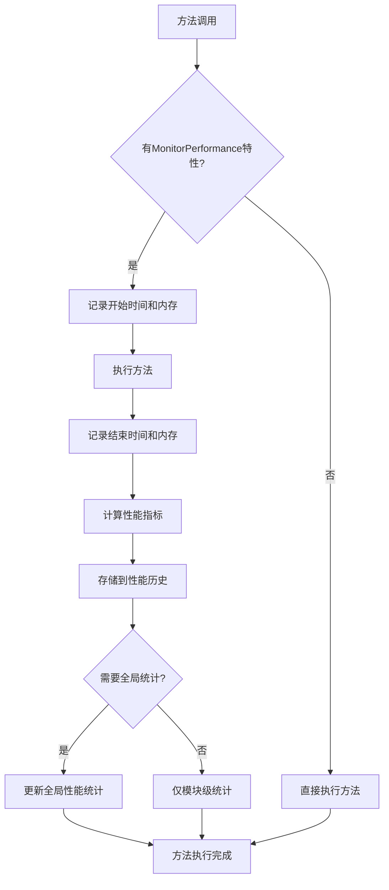

# 🧠 Cnoom Unity Framework 项目记忆体系

## 📋 目录
- [1. 核心功能模块划分及交互逻辑](#1-核心功能模块划分及交互逻辑)
- [2. 关键数据结构定义与应用场景](#2-关键数据结构定义与应用场景)
- [3. 模块间主要依赖关系图谱](#3-模块间主要依赖关系图谱)
- [4. 重要配置参数及作用范围](#4-重要配置参数及作用范围)
- [5. 典型业务场景执行流程](#5-典型业务场景执行流程)
- [6. 快速解析指南](#6-快速解析指南)

---

## 1. 核心功能模块划分及交互逻辑

### 1.1 架构层次划分



### 1.2 核心模块功能职责

| 模块名称 | 主要职责 | 关键接口 | 生命周期 |
|---------|---------|----------|----------|
| **FrameworkManager** | 框架核心管理器，统一管理所有模块 | `Initialize()`, `Shutdown()`, `RegisterModule<T>()` | 单例持久化 |
| **EventBus** | 事件通信中枢，支持广播/单播/请求响应 | `Broadcast<T>()`, `SendCommand<T>()`, `Query<TQ,TR>()` | 框架生命周期 |
| **ConfigManager** | 配置管理，支持多源配置和热更新 | `GetValue<T>()`, `SetValue<T>()`, `RegisterChangeListener()` | 框架生命周期 |
| **ErrorRecoveryManager** | 异常处理和恢复策略管理 | `HandleException()`, `RegisterRecoveryStrategy<T>()` | 框架生命周期 |
| **BaseModule** | 模块基类，提供标准生命周期 | `Init()`, `Start()`, `Shutdown()` | 模块生命周期 |

### 1.3 交互逻辑流程



---

## 2. 关键数据结构定义与应用场景

### 2.1 核心接口定义

#### IModule - 模块接口
```csharp
public interface IModule
{
    string Name { get; }           // 模块唯一标识
    ModuleState State { get; }     // 当前状态
    int Priority { get; }          // 初始化优先级
    void Init();                   // 初始化阶段
    void Start();                  // 启动阶段
    void Shutdown();               // 关闭阶段
}
```

**应用场景**: 所有业务模块必须实现此接口，确保统一的生命周期管理

#### IEventBus - 事件总线接口
```csharp
public interface IEventBus
{
    // 广播模式 - 一对多通信
    void Broadcast<T>(T data) where T : notnull;
    void SubscribeBroadcast<T>(Action<T> handler, int priority = 0, bool isAsync = false);
    
    // 命令模式 - 一对一通信
    void SendCommand<T>(T command) where T : notnull;
    void RegisterCommandHandler<T>(Action<T> handler, bool replaceIfExists = true);
    
    // 查询模式 - 请求响应通信
    TResponse Query<TQuery, TResponse>(TQuery query) where TQuery : notnull;
    void RegisterQueryHandler<TQuery, TResponse>(Func<TQuery, TResponse> handler);
}
```

**应用场景**: 模块间解耦通信，支持不同的通信模式

### 2.2 核心数据结构

#### ModuleState - 模块状态枚举
```csharp
public enum ModuleState
{
    Uninitialized,  // 未初始化 - 模块刚创建
    Initialized,    // 已初始化 - 完成Init()调用
    Started,        // 已启动 - 完成Start()调用，可正常工作
    Shutdown        // 已关闭 - 完成Shutdown()调用
}
```

#### ErrorRecord - 错误记录结构
```csharp
public class ErrorRecord
{
    public Exception Exception { get; set; }    // 异常对象
    public object Context { get; set; }         // 上下文信息
    public DateTime Timestamp { get; set; }     // 发生时间
    public ErrorSeverity Severity { get; set; } // 严重程度
}
```

#### PerformanceMetrics - 性能指标结构
```csharp
public class PerformanceMetrics
{
    public string OperationName { get; set; }   // 操作名称
    public TimeSpan ExecutionTime { get; set; } // 执行时间
    public long MemoryBefore { get; set; }      // 执行前内存
    public long MemoryAfter { get; set; }       // 执行后内存
    public DateTime Timestamp { get; set; }     // 记录时间
    public string ModuleName { get; set; }      // 所属模块
}
```

### 2.3 特性(Attributes)系统

#### 自动注册特性
```csharp
[AutoRegisterModule(Priority = 100, InterfaceType = typeof(IPlayerModule))]
public class PlayerModule : BaseModule, IPlayerModule { }
```

#### 事件处理特性
```csharp
[BroadcastHandler(Priority = 0, IsAsync = false)]
private void OnHealthChanged(HealthChangedEvent evt) { }

[CommandHandler(ReplaceIfExists = true)]
private void OnPlayerAttack(PlayerAttackCommand cmd) { }

[QueryHandler]
private PlayerStats OnGetPlayerStats(GetPlayerStatsQuery query) { }
```

#### 性能监控特性
```csharp
[MonitorPerformance("PlayerUpdate", RecordToGlobalStats = true)]
public void UpdatePlayer() { }
```

---

## 3. 模块间主要依赖关系图谱

### 3.1 依赖层次结构



### 3.2 依赖声明示例

```csharp
// 音频模块依赖配置模块
[DependsOn(typeof(ConfigModule))]
public class AudioModule : BaseModule { }

// UI模块依赖玩家模块和音频模块
[DependsOn(typeof(PlayerModule))]
[DependsOn(typeof(AudioModule))]
public class UIModule : BaseModule { }

// 游戏逻辑模块依赖所有基础模块
[DependsOn(typeof(PlayerModule))]
[DependsOn(typeof(UIModule))]
[DependsOn(typeof(AudioModule))]
public class GameLogicModule : BaseModule { }
```

### 3.3 循环依赖检测

框架在初始化时会自动检测循环依赖：
```csharp
private void VisitModule(IModule module, HashSet<Type> visited, HashSet<Type> visiting, List<IModule> sortedModules)
{
    var moduleType = module.GetType();
    if (visiting.Contains(moduleType)) 
        throw new InvalidOperationException($"检测到涉及模块的循环依赖关系 [{module.Name}]");
    // ... 依赖解析逻辑
}
```

---

## 4. 重要配置参数及作用范围

### 4.1 框架级配置

| 配置键 | 默认值 | 作用范围 | 说明 |
|--------|--------|----------|------|
| `EventBus.MaxCachedEvents` | 1000 | 全局 | 事件总线最大缓存事件数量 |
| `EventBus.MaxAsyncHandlersPerFrame` | 64 | 全局 | 每帧最大异步处理器执行数量 |
| `EventBus.EnableInheritanceDispatch` | true | 全局 | 是否启用继承分发机制 |
| `ErrorRecovery.MaxErrorHistoryCount` | 100 | 全局 | 错误历史记录最大数量 |
| `Performance.EnableMonitoring` | true | 全局 | 是否启用性能监控 |
| `Performance.SamplingInterval` | 1.0f | 全局 | 性能采样间隔(秒) |

### 4.2 配置源优先级

```csharp
// 优先级从高到低
1. MemoryConfigSource      // 运行时临时配置
2. PlayerPrefsConfigSource // 持久化用户配置  
3. JsonFileConfigSource    // 文件配置
4. ResourceJsonConfigSource // 资源配置
```

### 4.3 配置使用示例

```csharp
// 获取配置值
var maxEvents = ConfigManager.GetValue("EventBus.MaxCachedEvents", 1000);

// 设置配置值
ConfigManager.SetValue("Performance.EnableMonitoring", true, persistent: true);

// 监听配置变化
ConfigManager.RegisterChangeListener<bool>("Performance.EnableMonitoring", 
    (key, value) => {
        PerformanceMonitor.SetEnabled(value);
    });
```

---

## 5. 典型业务场景执行流程

### 5.1 框架初始化流程

```mermaid
flowchart TD
    A[应用启动] --> B[FrameworkManager.Initialize()]
    B --> C[初始化EventBus]
    C --> D[初始化ErrorRecoveryManager]
    D --> E[初始化ConfigManager]
    E --> F[初始化MockManager]
    F --> G[应用EventBus配置]
    G --> H[自动发现模块]
    H --> I[解析依赖关系]
    I --> J[按依赖顺序初始化模块]
    J --> K[按依赖顺序启动模块]
    K --> L[发布FrameworkInitializedEvent]
    L --> M[框架就绪]
```

### 5.2 模块通信流程

#### 广播事件流程


#### 命令处理流程


#### 查询响应流程


### 5.3 错误处理流程

```mermaid
flowchart TD
    A[模块执行异常] --> B[SafeExecutor捕获]
    B --> C[ErrorRecoveryManager.HandleException()]
    C --> D{查找恢复策略}
    D -->|找到策略| E[执行恢复策略]
    D -->|未找到策略| F[记录错误日志]
    E --> G{恢复成功?}
    G -->|成功| H[继续执行]
    G -->|失败| I[记录恢复失败]
    F --> I
    I --> J[发布ErrorOccurredEvent]
    H --> K[正常流程继续]
```

### 5.4 性能监控流程



---

## 6. 快速解析指南

### 6.1 项目架构快速解析

**🔍 关键入口点**:
- `FrameworkManager.cs` - 框架核心管理器，所有功能的统一入口
- `IModule.cs` - 模块接口定义，理解模块生命周期的关键
- `EventBus.cs` - 事件通信核心，模块间解耦通信的基础

**📁 目录结构解析**:
```
Runtime/Core/           # 框架核心功能
├── Attributes/         # 特性定义(自动注册、事件处理等)
├── Config/            # 配置管理系统
├── Contracts/         # 契约验证系统
├── ErrorHandling/     # 错误处理和恢复
├── EventBuss/         # 事件总线系统
├── Events/            # 框架事件定义
├── Exceptions/        # 框架异常定义
└── Mock/              # Mock和测试支持

Editor/                # 编辑器工具
├── FrameworkDebuggerWindow.cs  # 主调试窗口
├── PerformancePanel.cs         # 性能监控面板
├── ModuleStatusViewer.cs       # 模块状态查看器
└── EventBusMonitor.cs          # 事件总线监控器
```

### 6.2 上下文精准追溯

**🔗 事件流追溯**:
1. 使用`EventFlowRecorder`记录事件流
2. 通过`FrameworkDebuggerWindow`可视化事件流
3. 每个事件包含发送者、接收者、时间戳信息

**📊 模块状态追溯**:
1. 模块状态变化会发布`ModuleStateChangedEvent`
2. 可通过`ModuleStatusViewer`查看所有模块当前状态
3. 错误历史记录在`ErrorRecoveryManager`中可查询

**⚡ 性能追溯**:
1. 使用`MonitorPerformanceAttribute`标记需要监控的方法
2. 性能数据存储在`PerformanceMonitor`中
3. 可通过`PerformancePanel`查看实时和历史性能数据

### 6.3 新需求开发智能提示

**🚀 添加新模块**:
1. 继承`BaseModule`类
2. 重写`OnInit()`, `OnStart()`, `OnShutdown()`方法
3. 使用`[AutoRegisterModule]`特性自动注册
4. 使用事件特性`[BroadcastHandler]`, `[CommandHandler]`, `[QueryHandler]`处理通信

**📡 添加新事件**:
1. 定义事件类，实现相应接口
2. 在发送方使用`EventBus.Broadcast()`, `SendCommand()`, `Query()`
3. 在接收方使用特性或手动注册处理器

**⚙️ 添加新配置**:
1. 在`ConfigManager`中定义配置键
2. 使用`GetValue()`和`SetValue()`访问配置
3. 使用`RegisterChangeListener()`监听配置变化

**🛠️ 添加新的错误恢复策略**:
1. 实现`IErrorRecoveryStrategy`接口
2. 在框架初始化时注册策略
3. 策略会自动应用到对应的异常类型

**📈 添加性能监控**:
1. 在需要监控的方法上添加`[MonitorPerformance]`特性
2. 性能数据会自动收集和存储
3. 可通过编辑器工具查看性能报告

---

## 🎯 总结

这个项目记忆体系提供了：

✅ **完整的架构理解** - 从模块划分到交互逻辑的全面覆盖
✅ **精确的数据结构定义** - 关键接口和数据结构的详细说明  
✅ **清晰的依赖关系** - 模块间依赖的可视化展示
✅ **全面的配置管理** - 重要参数的作用范围和使用方法
✅ **典型流程指导** - 常见业务场景的执行流程
✅ **快速开发指南** - 新需求开发的智能提示和最佳实践

通过这个记忆体系，开发者可以快速理解项目架构、准确追溯上下文信息，并获得新需求开发时的智能提示，大大提高开发效率和代码质量。